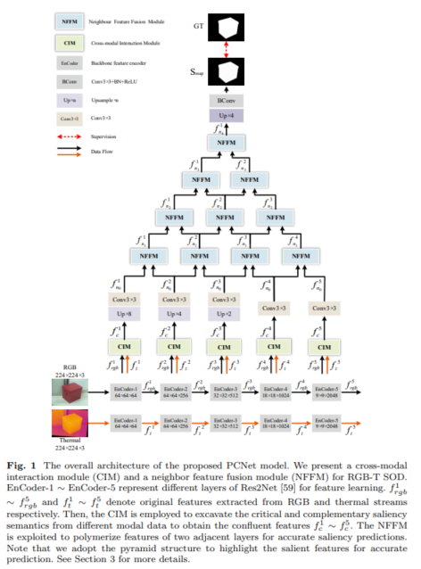

# Pyramid Contract-based Network for RGB-T Salient Object Detection

   Figure.1 The overall architecture of the proposed PCNet model.  
   The paper can be downloaded from [here], which is accepted in Multimedia Tools and Appllications 🎆.
# 1.Requirements
Python v3.6, Pytorch 0.4.0+, Cuda 10.0, TensorboardX 2.0, opencv-python

# 2.Data Preparation
Download the train dataset from [here](https://pan.baidu.com/s/1vsKOKWhak6pvcwJ6Q2VdRQ)[code:NEPU], test dataset from [here](https://pan.baidu.com/s/1mDP02q1P5V5QocMRbCXIow
)[code:NEPU]. Then put them under the following directory: 

    -Dataset\   
       -train\  
       -test\ 
           -VT821\
           -VT1000\
           -VT5000_test\
       -test_in_train\
           
# 3.Training/Testing & Evaluating
* **Training the PCNet**  

Please download the released code and then:  
  
    run python Train.py  

* **Testing the PCNet**  

Please complete the training and then:  

    run python Test.py  

Then the test maps will be saved to './Salmaps/'

* **Evaluate the result maps**  

You can evaluate the result maps using the tool from [here](https://pan.baidu.com/s/1gmckcn7FZuDP2ufiTM6qow)[code:NEPU], thanks for [Dengpin Fan](https://github.com/DengPingFan).

# 4.Results
* **Qualitative comparison**  

  
Figure.2 Qualitative comparison of our proposed method with some SOTA methods.  

* **Quantitative comparison** 

  
Table.1 Quantitative comparison with some SOTA models on there public RGB-T benchmark datasets. 

